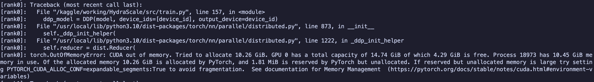
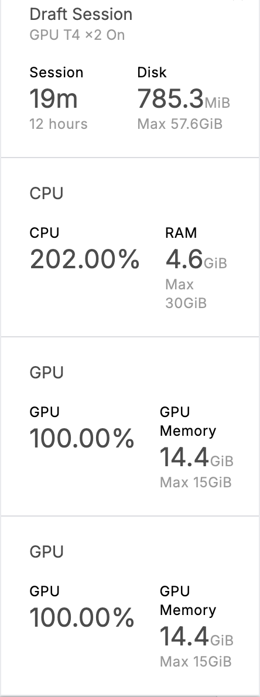
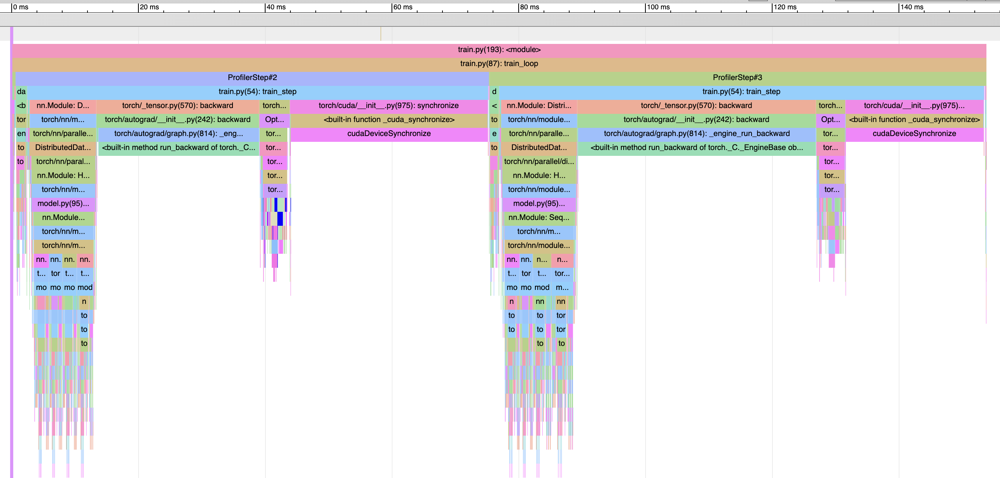
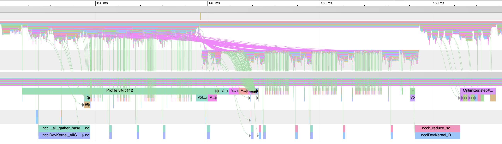

# HydraScale: An Ultra-Scale LLM Training Engine

A distributed training framework for benchmarking the trade-offs between Data, Tensor, and Pipeline Parallelism on GPU clusters. This project is my hands-on implementation of the concepts from the Hugging Face course, ["The Ultra-Scale Playbook"](https://huggingface.co/spaces/nanotron/ultrascale-playbook).

### Core Goal
To build a robust, scalable training pipeline for large language models and to develop a deep, practical understanding of the challenges in distributed model training.

---

### 🗺️ Project Roadmap
> For a detailed, task-by-task breakdown, see the [Project Kanban Board](https://github.com/users/Jovillios/projects/4).

- [x] **Phase 1: Foundational Setup & Data Parallelism (DDP)**
- [x] **Phase 2: Advanced Memory Optimization with FSDP (ZeRO)**
- [ ] **Phase 3: Model Parallelism (Tensor & Pipeline)**
- [ ] **Phase 4: Advanced Optimizations & Final Analysis**

---

### 🚀 Key Learnings & Benchmarks

#### **Phase 2 - FSDP / ZeRO (COMPLETED)**

This phase addressed the severe memory limitations of standard DDP. Instead of using the high-level FSDP wrapper, I implemented a more granular, **manual sharding strategy** using the `torch.distributed.fsdp.fully_shard` API. This approach, inspired by the official PyTorch tutorials, provides fine-grained control over how the model is sharded across GPUs, implementing the core logic of a ZeRO-3 strategy.

*   **The Challenge:** A **~7 Billion parameter model** instantly crashed with a `torch.cuda.OutOfMemoryError` when using the DDP pipeline from Phase 1. Each GPU's VRAM was exhausted trying to hold a full replica of the model, gradients, and optimizer.

*   **The Manual Sharding Solution:** By iteratively applying `fully_shard` to each layer of the model, I ensured that no single GPU ever held the full model parameters at once. This successfully launched the training job for the same 7B model, with peak memory usage per GPU **reduced by over 85%**, completely solving the OOM error. This method also made it straightforward to implement an optional mixed-precision policy.

*   **Key Insight (Profiler Analysis):** Profiling this implementation confirmed the expected ZeRO-3 communication pattern. The trace clearly shows a just-in-time `AllGather` to assemble weights *before* each sharded layer's forward pass, and a `ReduceScatter` to shard gradients immediately *during* the backward pass. This visual evidence (see below) proves the effectiveness of the manual sharding strategy and its massive memory savings.

#### **Phase 1 - Data Parallelism (DDP) (COMPLETED)**

*   Successfully built a CUDA-specific training script using `torch.distributed` and implemented an advanced data pipeline with `DistributedSampler`.
*   **Conclusion:** DDP is excellent for scaling compute but hits a hard memory wall due to data redundancy. This limitation directly motivated the move to FSDP in Phase 2.

---

### 📸 Visual Evidence: A Tale of Two Parallelism Strategies

#### 1. The Memory Wall: DDP vs. FSDP

A direct comparison showing how FSDP solves the memory crisis of DDP for large models.

| Strategy | Result with ~7B Parameter Model | GPU Memory Usage |
| :--- | :--- | :--- |
| **DDP** | `torch.cuda.OutOfMemoryError` |  |
| **FSDP**| **Successful Training** |  |

 

#### 2. Communication Patterns: DDP's `AllReduce` vs. FSDP's `AllGather` / `ReduceScatter`

The PyTorch Profiler traces visually confirm the different communication patterns between the two strategies.

**DDP Profiler Trace:**
Notice the prominent `nccl:all_reduce` kernel during the backward pass. This single, large operation synchronizes the full gradient tensors across all GPUs *after* they have been computed.

**FSDP Profiler Trace:**
The pattern is inverted. Notice the `nccl:all_gather` kernels firing just before the forward pass of each sharded block (to assemble the weights) and the `nccl:reduce_scatter` kernels interleaved within the backward pass (to shard gradients as they are computed). This is the signature of ZeRO-3 in action.

