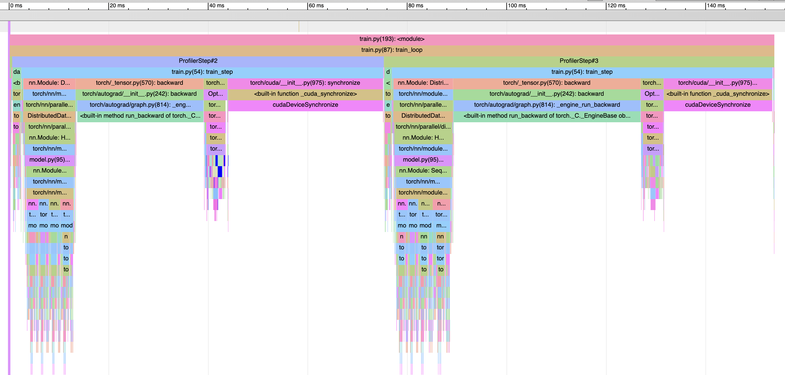

# HydraScale : An Ultra-Scale LLM Training Engine

A distributed training framework for benchmarking the trade-offs between Data, Tensor, and Pipeline Parallelism on GPU clusters. This project is my hands-on implementation of the concepts from the Hugging Face course, ["The Ultra-Scale Playbook"](https://huggingface.co/spaces/nanotron/ultrascale-playbook?section=high-level_overview).

### Core Goal
To build a robust, scalable training pipeline for large language models and to develop a deep, practical understanding of the challenges in distributed model training.

---

### 📍 Current Status
*I am currently working on **Phase 1: Foundational Setup & Data Parallelism**.*

### 🗺️ Project Roadmap

> For a detailed, task-by-task breakdown of my work, please see the [Project Kanban Board](https://github.com/users/Jovillios/projects/4).

- [x] **Phase 1: Foundational Setup & Data Parallelism**
- [x] **Phase 2: Advanced Memory Optimization with ZeRO**
- [ ] **Phase 3: Model Parallelism (Tensor & Pipeline)**
- [ ] **Phase 4: Advanced Optimizations & Final Analysis**

### 🚀 Key Learnings & Benchmarks

**Phase 1 - Data Parallelism (DDP):**
*   Successfully built a hardware-agnostic training script capable of running on both CPU (Gloo backend) and multi-GPU (NCCL backend) setups.
*   Implemented a sophisticated data pipeline to tokenize and batch raw text data efficiently.
*   Used `torch.profiler` to diagnose a major performance bottleneck, revealing that the data loading pipeline was slower than the model's forward/backward pass. This highlighted the critical importance of optimizing `num_workers` and considering pre-tokenization.
*   **Key Insight:** While DDP is excellent for scaling compute, it does not solve memory limitations, as every GPU still holds a full copy of the model, gradients, and optimizer states. This perfectly motivates the need for Phase 2

#### 📸 Profiler Screenshot

Below is a screenshot of the HydraScale training loop profiled using PyTorch's built-in Profiler. This gives insights into kernel execution, bottlenecks, and hardware utilization.

*Example: First forward-backward pass with DDP on a single GPU.*

#### 📸 OOM Screenshot

Below is a screenshot of a out of memory error obtain when scaling the model to the limit of the GPUs without using any sharding strategy yet.

